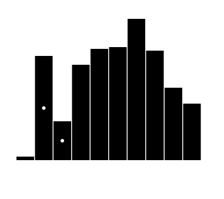
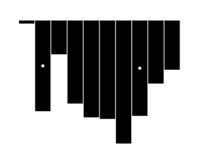
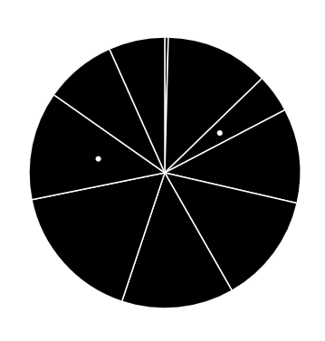
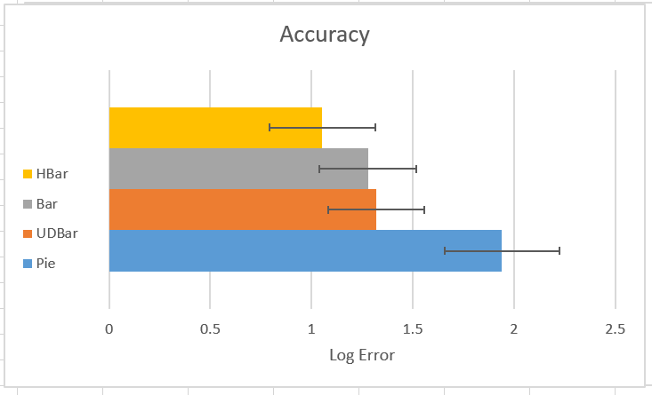

Assignment 3 - Replicating a Classic Experiment  
===

I chose four different types of visualizations to test during this replication of the
seminal Cleveland Mcgill experiment: vertical bar charts, horizontal bar charts,
upside down bar charts, and pie charts. Each participant was shown 30 variations of each type
of chart, each with 10 randomly generated regions with two to compare indicated by white circles. Sample images
of the visualizations are as follows:

## Hypotheses
1. Participants will make more accurate measurements with the vertical bar chart than the horizontal bar chart.
2. Participants will make more accurate measurements with the horizontal bar chart than the upside down bar chart.
3. Participants will make the least accurate measurements with the upside down bar chart.
4. Participants will make similarly accurate measurements with the horizontal bar chart and pie chart.

## Results

The results obtained through the experiment are shown in the following image:

Out of all of my hypotheses, only one was confirmed: participants did make more accurate measurements using the horizontal bar
chart versus the upside down bar chart (2). It was surprising to me how much worse the pie chart performed than
any of the variations of the bar chart. I expected the upside down bar chart to be less effective.

## Technical Achievements
- My key technical achievement in this project is the implementation of a server using the
firebase web application sdk. This allowed me to store survey results in the firebase realtime database which syncs across
clients. This made it easier for people to take my survey because they weren't forced to download a csv at the end and send me an email. It was
also easier on my end to just export the entire database json to csv before running the statistical analysis for results.
- I used four different types of visualizations whereas only three were required.
- Each visualization was given 30 iterations in each experiment whereas only 20 were required.
- These features made the survey slightly longer but led to more robust results given the increase in data.

## Design Achievements
- Displaying progress throughout the experiment to the user
- Notifying the user of invalid input
- Aesthetically pleasing fonts
- Alignment across the experiment to support responsive design.
- End-to-end experience for the user - alerting completion with a thank you message.

Sources
---
https://bl.ocks.org/d3noob/bdf28027e0ce70bd132edc64f1dd7ea4
https://bl.ocks.org/santi698/f3685ca8a1a7f5be1967f39f367437c0
https://www.w3schools.com/js/js_validation.asp
https://gist.github.com/DustinMooney/2144313
https://firebase.google.com/docs/database/web/start